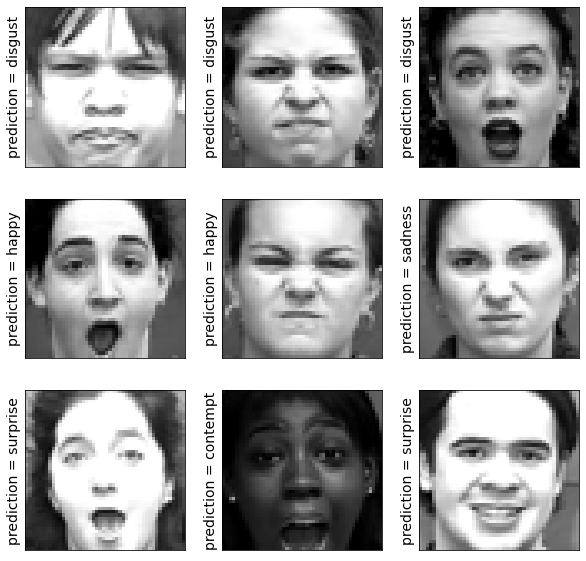
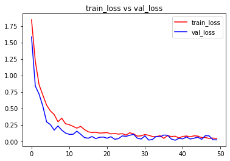
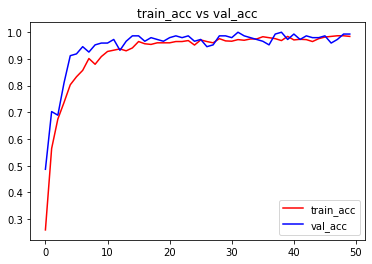

```python
import numpy as np # linear algebra
import pandas as pd # data processing, CSV file I/O (e.g. pd.read_csv)
import os,cv2
import numpy as np
import matplotlib.pyplot as plt
import matplotlib.image as mpimg
from pylab import rcParams
rcParams['figure.figsize'] = 20, 10

from sklearn.utils import shuffle
from sklearn.model_selection import train_test_split

import keras

from keras.utils import np_utils
# Input data files are available in the "../input/" directory.
# For example, running this (by clicking run or pressing Shift+Enter) will list the files in the input directory
from keras.models import Sequential
from keras.layers import Dense , Activation , Dropout ,Flatten
from keras.layers.convolutional import Conv2D
from keras.layers.convolutional import MaxPooling2D
from keras.metrics import categorical_accuracy
from keras.models import model_from_json
from keras.callbacks import ModelCheckpoint
from keras.optimizers import *
from keras.layers.normalization import BatchNormalization
import os
print(os.listdir("./input/ck/"))
```

    ['CK+48']
    


```python
data_path = './input/ck/CK+48'
data_dir_list = os.listdir(data_path)

img_rows=256
img_cols=256
num_channel=1

num_epoch=10

img_data_list=[]


for dataset in data_dir_list:
    img_list=os.listdir(data_path+'/'+ dataset)
    print ('Loaded the images of dataset-'+'{}\n'.format(dataset))
    for img in img_list:
        input_img=cv2.imread(data_path + '/'+ dataset + '/'+ img )
        #input_img=cv2.cvtColor(input_img, cv2.COLOR_BGR2GRAY)
        input_img_resize=cv2.resize(input_img,(48,48))
        img_data_list.append(input_img_resize)
        
img_data = np.array(img_data_list)
img_data = img_data.astype('float32')
img_data = img_data/255
img_data.shape
```

    Loaded the images of dataset-anger
    
    Loaded the images of dataset-contempt
    
    Loaded the images of dataset-disgust
    
    Loaded the images of dataset-fear
    
    Loaded the images of dataset-happy
    
    Loaded the images of dataset-sadness
    
    Loaded the images of dataset-surprise
    
    


    (981, 48, 48, 3)


```python
num_classes = 7

num_of_samples = img_data.shape[0]
labels = np.ones((num_of_samples,),dtype='int64')

labels[0:134]=0 #135
labels[135:188]=1 #54
labels[189:365]=2 #177
labels[366:440]=3 #75
labels[441:647]=4 #207
labels[648:731]=5 #84
labels[732:980]=6 #249

names = ['anger','contempt','disgust','fear','happy','sadness','surprise']

def getLabel(id):
    return ['anger','contempt','disgust','fear','happy','sadness','surprise'][id]
```


```python
Y = np_utils.to_categorical(labels, num_classes)

#Shuffle the dataset
x,y = shuffle(img_data,Y, random_state=2)
# Split the dataset
X_train, X_test, y_train, y_test = train_test_split(x, y, test_size=0.15, random_state=2)
x_test=X_test
```


```python
input_shape=(48,48,3)

model = Sequential()
model.add(Conv2D(6, (5, 5), input_shape=input_shape, padding='same', activation = 'relu'))
model.add(MaxPooling2D(pool_size=(2, 2)))

model.add(Conv2D(16, (5, 5), padding='same', activation = 'relu'))
model.add(Activation('relu'))
model.add(MaxPooling2D(pool_size=(2, 2)))

model.add(Conv2D(64, (3, 3), activation = 'relu'))
model.add(MaxPooling2D(pool_size=(2, 2)))

model.add(Flatten())
model.add(Dense(128, activation = 'relu'))
model.add(Dropout(0.5))
model.add(Dense(7, activation = 'softmax'))

model.compile(loss='categorical_crossentropy', metrics=['accuracy'],optimizer='adam')
```


```python
model.summary()
model.get_config()
model.layers[0].get_config()
model.layers[0].input_shape
model.layers[0].output_shape
model.layers[0].get_weights()
np.shape(model.layers[0].get_weights()[0])
model.layers[0].trainable
```

    Model: "sequential"
    _________________________________________________________________
    Layer (type)                 Output Shape              Param #   
    =================================================================
    conv2d (Conv2D)              (None, 48, 48, 6)         456       
    _________________________________________________________________
    max_pooling2d (MaxPooling2D) (None, 24, 24, 6)         0         
    _________________________________________________________________
    conv2d_1 (Conv2D)            (None, 24, 24, 16)        2416      
    _________________________________________________________________
    activation (Activation)      (None, 24, 24, 16)        0         
    _________________________________________________________________
    max_pooling2d_1 (MaxPooling2 (None, 12, 12, 16)        0         
    _________________________________________________________________
    conv2d_2 (Conv2D)            (None, 10, 10, 64)        9280      
    _________________________________________________________________
    max_pooling2d_2 (MaxPooling2 (None, 5, 5, 64)          0         
    _________________________________________________________________
    flatten (Flatten)            (None, 1600)              0         
    _________________________________________________________________
    dense (Dense)                (None, 128)               204928    
    _________________________________________________________________
    dropout (Dropout)            (None, 128)               0         
    _________________________________________________________________
    dense_1 (Dense)              (None, 7)                 903       
    =================================================================
    Total params: 217,983
    Trainable params: 217,983
    Non-trainable params: 0
    _________________________________________________________________
    


    True


```python
from keras import callbacks
filename='model_train_new.csv'
filepath="Best-weights-my_model-{epoch:03d}-{loss:.4f}-{acc:.4f}.hdf5"

csv_log=callbacks.CSVLogger(filename, separator=',', append=False)
checkpoint = callbacks.ModelCheckpoint(filepath, monitor='val_loss', verbose=1, save_best_only=True, mode='min')
callbacks_list = [csv_log,checkpoint]
callbacks_list = [csv_log]
```


```python
hist = model.fit(X_train, y_train, batch_size=7, epochs=50, verbose=1, validation_data=(X_test, y_test),callbacks=callbacks_list)
```

    Epoch 1/50
    119/119 [==============================] - 3s 25ms/step - loss: 1.8451 - accuracy: 0.2593 - val_loss: 1.5847 - val_accuracy: 0.4865
    Epoch 2/50
    119/119 [==============================] - 2s 19ms/step - loss: 1.2157 - accuracy: 0.5642 - val_loss: 0.8393 - val_accuracy: 0.7027
    Epoch 3/50
    119/119 [==============================] - 2s 19ms/step - loss: 0.8574 - accuracy: 0.6747 - val_loss: 0.7157 - val_accuracy: 0.6892
    Epoch 4/50
    119/119 [==============================] - 3s 23ms/step - loss: 0.7007 - accuracy: 0.7371 - val_loss: 0.5319 - val_accuracy: 0.8108
    Epoch 5/50
    119/119 [==============================] - 2s 19ms/step - loss: 0.5480 - accuracy: 0.8031 - val_loss: 0.2932 - val_accuracy: 0.9122
    Epoch 6/50
    119/119 [==============================] - 2s 19ms/step - loss: 0.4595 - accuracy: 0.8331 - val_loss: 0.2534 - val_accuracy: 0.9189
    Epoch 7/50
    119/119 [==============================] - 3s 24ms/step - loss: 0.4063 - accuracy: 0.8571 - val_loss: 0.1689 - val_accuracy: 0.9459
    Epoch 8/50
    119/119 [==============================] - 2s 20ms/step - loss: 0.2956 - accuracy: 0.9016 - val_loss: 0.2337 - val_accuracy: 0.9257
    Epoch 9/50
    119/119 [==============================] - 2s 19ms/step - loss: 0.3498 - accuracy: 0.8800 - val_loss: 0.1689 - val_accuracy: 0.9527
    Epoch 10/50
    119/119 [==============================] - 3s 23ms/step - loss: 0.2664 - accuracy: 0.9088 - val_loss: 0.1252 - val_accuracy: 0.9595
    Epoch 11/50
    119/119 [==============================] - 2s 19ms/step - loss: 0.2510 - accuracy: 0.9280 - val_loss: 0.1044 - val_accuracy: 0.9595
    Epoch 12/50
    119/119 [==============================] - 3s 24ms/step - loss: 0.2265 - accuracy: 0.9328 - val_loss: 0.1064 - val_accuracy: 0.9730
    Epoch 13/50
    119/119 [==============================] - 2s 19ms/step - loss: 0.1990 - accuracy: 0.9376 - val_loss: 0.1529 - val_accuracy: 0.9324
    Epoch 14/50
    119/119 [==============================] - 3s 25ms/step - loss: 0.2267 - accuracy: 0.9304 - val_loss: 0.1070 - val_accuracy: 0.9662
    Epoch 15/50
    119/119 [==============================] - 2s 19ms/step - loss: 0.1782 - accuracy: 0.9412 - val_loss: 0.0566 - val_accuracy: 0.9865
    Epoch 16/50
    119/119 [==============================] - 3s 22ms/step - loss: 0.1441 - accuracy: 0.9652 - val_loss: 0.0460 - val_accuracy: 0.9865
    Epoch 17/50
    119/119 [==============================] - 2s 20ms/step - loss: 0.1321 - accuracy: 0.9568 - val_loss: 0.0722 - val_accuracy: 0.9662
    Epoch 18/50
    119/119 [==============================] - 3s 24ms/step - loss: 0.1364 - accuracy: 0.9544 - val_loss: 0.0403 - val_accuracy: 0.9797
    Epoch 19/50
    119/119 [==============================] - 3s 21ms/step - loss: 0.1250 - accuracy: 0.9604 - val_loss: 0.0609 - val_accuracy: 0.9730
    Epoch 20/50
    119/119 [==============================] - 3s 25ms/step - loss: 0.1273 - accuracy: 0.9604 - val_loss: 0.0641 - val_accuracy: 0.9662
    Epoch 21/50
    119/119 [==============================] - 3s 21ms/step - loss: 0.1319 - accuracy: 0.9604 - val_loss: 0.0463 - val_accuracy: 0.9797
    Epoch 22/50
    119/119 [==============================] - 3s 25ms/step - loss: 0.1120 - accuracy: 0.9652 - val_loss: 0.0693 - val_accuracy: 0.9865
    Epoch 23/50
    119/119 [==============================] - 2s 19ms/step - loss: 0.1192 - accuracy: 0.9652 - val_loss: 0.0308 - val_accuracy: 0.9797
    Epoch 24/50
    119/119 [==============================] - 2s 18ms/step - loss: 0.1081 - accuracy: 0.9688 - val_loss: 0.0394 - val_accuracy: 0.9865
    Epoch 25/50
    119/119 [==============================] - 3s 24ms/step - loss: 0.1158 - accuracy: 0.9520 - val_loss: 0.0819 - val_accuracy: 0.9662
    Epoch 26/50
    119/119 [==============================] - 2s 19ms/step - loss: 0.0948 - accuracy: 0.9712 - val_loss: 0.0750 - val_accuracy: 0.9730
    Epoch 27/50
    119/119 [==============================] - 2s 20ms/step - loss: 0.1294 - accuracy: 0.9652 - val_loss: 0.0908 - val_accuracy: 0.9459
    Epoch 28/50
    119/119 [==============================] - 2s 21ms/step - loss: 0.1126 - accuracy: 0.9604 - val_loss: 0.1061 - val_accuracy: 0.9527
    Epoch 29/50
    119/119 [==============================] - 3s 21ms/step - loss: 0.0782 - accuracy: 0.9760 - val_loss: 0.0468 - val_accuracy: 0.9865
    Epoch 30/50
    119/119 [==============================] - 3s 21ms/step - loss: 0.0829 - accuracy: 0.9676 - val_loss: 0.0337 - val_accuracy: 0.9865
    Epoch 31/50
    119/119 [==============================] - 3s 23ms/step - loss: 0.1032 - accuracy: 0.9664 - val_loss: 0.0832 - val_accuracy: 0.9797
    Epoch 32/50
    119/119 [==============================] - 2s 21ms/step - loss: 0.0914 - accuracy: 0.9724 - val_loss: 0.0182 - val_accuracy: 1.0000
    Epoch 33/50
    119/119 [==============================] - 2s 19ms/step - loss: 0.0724 - accuracy: 0.9700 - val_loss: 0.0276 - val_accuracy: 0.9865
    Epoch 34/50
    119/119 [==============================] - 2s 18ms/step - loss: 0.0687 - accuracy: 0.9748 - val_loss: 0.0757 - val_accuracy: 0.9797
    Epoch 35/50
    119/119 [==============================] - 2s 19ms/step - loss: 0.0859 - accuracy: 0.9748 - val_loss: 0.0670 - val_accuracy: 0.9730
    Epoch 36/50
    119/119 [==============================] - 3s 25ms/step - loss: 0.0443 - accuracy: 0.9832 - val_loss: 0.0950 - val_accuracy: 0.9662
    Epoch 37/50
    119/119 [==============================] - 2s 21ms/step - loss: 0.0861 - accuracy: 0.9796 - val_loss: 0.0912 - val_accuracy: 0.9527
    Epoch 38/50
    119/119 [==============================] - 2s 19ms/step - loss: 0.0720 - accuracy: 0.9760 - val_loss: 0.0340 - val_accuracy: 0.9932
    Epoch 39/50
    119/119 [==============================] - 2s 20ms/step - loss: 0.0773 - accuracy: 0.9688 - val_loss: 0.0163 - val_accuracy: 1.0000
    Epoch 40/50
    119/119 [==============================] - 2s 18ms/step - loss: 0.0505 - accuracy: 0.9844 - val_loss: 0.0443 - val_accuracy: 0.9730
    Epoch 41/50
    119/119 [==============================] - 3s 23ms/step - loss: 0.0734 - accuracy: 0.9712 - val_loss: 0.0362 - val_accuracy: 0.9932
    Epoch 42/50
    119/119 [==============================] - 2s 19ms/step - loss: 0.0802 - accuracy: 0.9736 - val_loss: 0.0659 - val_accuracy: 0.9730
    Epoch 43/50
    119/119 [==============================] - 3s 23ms/step - loss: 0.0683 - accuracy: 0.9724 - val_loss: 0.0341 - val_accuracy: 0.9865
    Epoch 44/50
    119/119 [==============================] - 2s 21ms/step - loss: 0.0829 - accuracy: 0.9652 - val_loss: 0.0473 - val_accuracy: 0.9797
    Epoch 45/50
    119/119 [==============================] - 2s 18ms/step - loss: 0.0791 - accuracy: 0.9760 - val_loss: 0.0622 - val_accuracy: 0.9797
    Epoch 46/50
    119/119 [==============================] - 3s 21ms/step - loss: 0.0563 - accuracy: 0.9820 - val_loss: 0.0296 - val_accuracy: 0.9865
    Epoch 47/50
    119/119 [==============================] - 2s 19ms/step - loss: 0.0576 - accuracy: 0.9844 - val_loss: 0.0853 - val_accuracy: 0.9595
    Epoch 48/50
    119/119 [==============================] - 2s 19ms/step - loss: 0.0429 - accuracy: 0.9868 - val_loss: 0.0820 - val_accuracy: 0.9730
    Epoch 49/50
    119/119 [==============================] - 2s 20ms/step - loss: 0.0494 - accuracy: 0.9868 - val_loss: 0.0238 - val_accuracy: 0.9932
    Epoch 50/50
    119/119 [==============================] - 3s 22ms/step - loss: 0.0413 - accuracy: 0.9844 - val_loss: 0.0209 - val_accuracy: 0.9932
    


```python
score = model.evaluate(X_test, y_test, verbose=0)
print('Test Loss:', score[0])
print('Test accuracy:', score[1])

test_image = X_test[0:1]
print (test_image.shape)

print(model.predict(test_image))
print(model.predict_classes(test_image))
print(y_test[0:1])

res = model.predict_classes(X_test[9:18])
plt.figure(figsize=(10, 10))

for i in range(0, 9):
    plt.subplot(330 + 1 + i)
    plt.imshow(x_test[i],cmap=plt.get_cmap('gray'))
    plt.gca().get_xaxis().set_ticks([])
    plt.gca().get_yaxis().set_ticks([])
    plt.ylabel('prediction = %s' % getLabel(res[i]), fontsize=14)
# show the plot
plt.show()
```

    Test Loss: 0.0208963043987751
    Test accuracy: 0.9932432174682617
    (1, 48, 48, 3)
    [[9.9961901e-01 3.7680203e-04 6.3670086e-08 5.4794624e-10 1.2962689e-10
      4.0202813e-06 2.1726303e-11]]
    WARNING:tensorflow:From C:\Users\Sivajee\AppData\Local\Temp/ipykernel_1760/2922075397.py:9: Sequential.predict_classes (from tensorflow.python.keras.engine.sequential) is deprecated and will be removed after 2021-01-01.
    Instructions for updating:
    Please use instead:* `np.argmax(model.predict(x), axis=-1)`,   if your model does multi-class classification   (e.g. if it uses a `softmax` last-layer activation).* `(model.predict(x) > 0.5).astype("int32")`,   if your model does binary classification   (e.g. if it uses a `sigmoid` last-layer activation).
    [0]
    [[1. 0. 0. 0. 0. 0. 0.]]
    


    

    


```python
# visualizing losses and accuracy
%matplotlib inline

train_loss=hist.history['loss']
val_loss=hist.history['val_loss']
train_acc=hist.history['accuracy']
val_acc=hist.history['val_accuracy']

epochs = range(len(train_acc))

plt.plot(epochs,train_loss,'r', label='train_loss')
plt.plot(epochs,val_loss,'b', label='val_loss')
plt.title('train_loss vs val_loss')
plt.legend()
plt.figure()

plt.plot(epochs,train_acc,'r', label='train_acc')
plt.plot(epochs,val_acc,'b', label='val_acc')
plt.title('train_acc vs val_acc')
plt.legend()
plt.figure()
```


    <Figure size 432x288 with 0 Axes>


    

    


    

    


    <Figure size 432x288 with 0 Axes>


```python

```
