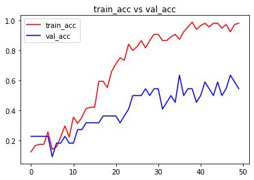

```python
import numpy as np # linear algebra
import pandas as pd # data processing, CSV file I/O (e.g. pd.read_csv)
import os,cv2
import numpy as np
import matplotlib.pyplot as plt
import matplotlib.image as mpimg
from pylab import rcParams
rcParams['figure.figsize'] = 20, 10

from sklearn.utils import shuffle
from sklearn.model_selection import train_test_split

import keras

from keras.utils import np_utils
# Input data files are available in the "../input/" directory.
# For example, running this (by clicking run or pressing Shift+Enter) will list the files in the input directory
from keras.models import Sequential
from keras.layers import Dense , Activation , Dropout ,Flatten
from keras.layers.convolutional import Conv2D
from keras.layers.convolutional import MaxPooling2D
from keras.metrics import categorical_accuracy
from keras.models import model_from_json
from keras.callbacks import ModelCheckpoint
from keras.optimizers import *
from keras.layers.normalization import BatchNormalization
import os
print(os.listdir("./input/jaffe"))
```

    ['train', 'valid']
    


```python
data_path = './input/jaffe/train'
data_dir_list = os.listdir(data_path)

img_rows=256
img_cols=256
num_channel=1

num_epoch=10

img_data_list=[]


for dataset in data_dir_list:
    img_list=os.listdir(data_path+'/'+ dataset)
    print ('Loaded the images of dataset-'+'{}\n'.format(dataset))
    for img in img_list:
        input_img=cv2.imread(data_path + '/'+ dataset + '/'+ img )
        #input_img=cv2.cvtColor(input_img, cv2.COLOR_BGR2GRAY)
        input_img_resize=cv2.resize(input_img,(48,48))
        img_data_list.append(input_img_resize)
        
img_data = np.array(img_data_list)
img_data = img_data.astype('float32')
img_data = img_data/255
img_data.shape
```

    Loaded the images of dataset-ANGRY
    
    Loaded the images of dataset-disgust
    
    Loaded the images of dataset-FEAR
    
    Loaded the images of dataset-HAPPY
    
    Loaded the images of dataset-NEUTRAL
    
    Loaded the images of dataset-SAD
    
    Loaded the images of dataset-SURPRISE
    
    


    (143, 48, 48, 3)


```python
num_classes = 7

num_of_samples = img_data.shape[0]
labels = np.ones((num_of_samples,),dtype='int64')

labels[0:19]=0 #20
labels[20:38]=1 #19
labels[39:60]=2 #22
labels[61:81]=3 #21
labels[82:101]=4 #20
labels[102:122]=5 #21
labels[123:142]=6 #20

names = ['anger','disgust','fear','happy','neutral','sadness','surprise']

def getLabel(id):
    return ['anger','disgust','fear','happy','neutral','sadness','surprise'][id]
```


```python
Y = np_utils.to_categorical(labels, num_classes)

#Shuffle the dataset
x,y = shuffle(img_data,Y, random_state=2)
# Split the dataset
X_train, X_test, y_train, y_test = train_test_split(x, y, test_size=0.15, random_state=2)
x_test=X_test
```


```python
input_shape=(48,48,3)

model = Sequential()
model.add(Conv2D(6, (5, 5), input_shape=input_shape, padding='same', activation = 'relu'))
model.add(MaxPooling2D(pool_size=(2, 2)))

model.add(Conv2D(16, (5, 5), padding='same', activation = 'relu'))
model.add(Activation('relu'))
model.add(MaxPooling2D(pool_size=(2, 2)))

model.add(Conv2D(64, (3, 3), activation = 'relu'))
model.add(MaxPooling2D(pool_size=(2, 2)))

model.add(Flatten())
model.add(Dense(128, activation = 'relu'))
model.add(Dropout(0.5))
model.add(Dense(7, activation = 'softmax'))

model.compile(loss='categorical_crossentropy', metrics=['accuracy'],optimizer='adam')
```


```python
model.summary()
model.get_config()
model.layers[0].get_config()
model.layers[0].input_shape
model.layers[0].output_shape
model.layers[0].get_weights()
np.shape(model.layers[0].get_weights()[0])
model.layers[0].trainable
```

    Model: "sequential"
    _________________________________________________________________
    Layer (type)                 Output Shape              Param #   
    =================================================================
    conv2d (Conv2D)              (None, 48, 48, 6)         456       
    _________________________________________________________________
    max_pooling2d (MaxPooling2D) (None, 24, 24, 6)         0         
    _________________________________________________________________
    conv2d_1 (Conv2D)            (None, 24, 24, 16)        2416      
    _________________________________________________________________
    activation (Activation)      (None, 24, 24, 16)        0         
    _________________________________________________________________
    max_pooling2d_1 (MaxPooling2 (None, 12, 12, 16)        0         
    _________________________________________________________________
    conv2d_2 (Conv2D)            (None, 10, 10, 64)        9280      
    _________________________________________________________________
    max_pooling2d_2 (MaxPooling2 (None, 5, 5, 64)          0         
    _________________________________________________________________
    flatten (Flatten)            (None, 1600)              0         
    _________________________________________________________________
    dense (Dense)                (None, 128)               204928    
    _________________________________________________________________
    dropout (Dropout)            (None, 128)               0         
    _________________________________________________________________
    dense_1 (Dense)              (None, 7)                 903       
    =================================================================
    Total params: 217,983
    Trainable params: 217,983
    Non-trainable params: 0
    _________________________________________________________________
    


    True


```python
from keras import callbacks
filename='model_train_new.csv'
filepath="Best-weights-my_model-{epoch:03d}-{loss:.4f}-{acc:.4f}.hdf5"

csv_log=callbacks.CSVLogger(filename, separator=',', append=False)
checkpoint = callbacks.ModelCheckpoint(filepath, monitor='val_loss', verbose=1, save_best_only=True, mode='min')
callbacks_list = [csv_log,checkpoint]
callbacks_list = [csv_log]
```


```python
hist = model.fit(X_train, y_train, batch_size=7, epochs=50, verbose=1, validation_data=(X_test, y_test),callbacks=callbacks_list)
```

    Epoch 1/50
    18/18 [==============================] - 1s 40ms/step - loss: 1.9893 - accuracy: 0.1240 - val_loss: 1.9488 - val_accuracy: 0.2273
    Epoch 2/50
    18/18 [==============================] - 0s 13ms/step - loss: 1.9401 - accuracy: 0.1653 - val_loss: 1.9480 - val_accuracy: 0.2273
    Epoch 3/50
    18/18 [==============================] - 0s 14ms/step - loss: 1.9468 - accuracy: 0.1736 - val_loss: 1.9656 - val_accuracy: 0.2273
    Epoch 4/50
    18/18 [==============================] - 0s 15ms/step - loss: 1.9308 - accuracy: 0.1736 - val_loss: 1.9994 - val_accuracy: 0.2273
    Epoch 5/50
    18/18 [==============================] - 0s 15ms/step - loss: 1.9189 - accuracy: 0.2562 - val_loss: 2.0542 - val_accuracy: 0.2273
    Epoch 6/50
    18/18 [==============================] - 0s 13ms/step - loss: 1.9227 - accuracy: 0.1405 - val_loss: 2.0288 - val_accuracy: 0.0909
    Epoch 7/50
    18/18 [==============================] - 0s 12ms/step - loss: 1.9242 - accuracy: 0.1570 - val_loss: 2.0053 - val_accuracy: 0.1818
    Epoch 8/50
    18/18 [==============================] - 0s 13ms/step - loss: 1.8893 - accuracy: 0.2231 - val_loss: 1.9903 - val_accuracy: 0.1818
    Epoch 9/50
    18/18 [==============================] - 0s 12ms/step - loss: 1.8378 - accuracy: 0.2975 - val_loss: 1.9917 - val_accuracy: 0.2273
    Epoch 10/50
    18/18 [==============================] - 0s 12ms/step - loss: 1.8268 - accuracy: 0.2231 - val_loss: 1.9717 - val_accuracy: 0.1818
    Epoch 11/50
    18/18 [==============================] - 0s 13ms/step - loss: 1.7512 - accuracy: 0.3554 - val_loss: 1.8723 - val_accuracy: 0.1818
    Epoch 12/50
    18/18 [==============================] - 0s 13ms/step - loss: 1.7154 - accuracy: 0.3140 - val_loss: 1.7811 - val_accuracy: 0.2727
    Epoch 13/50
    18/18 [==============================] - 0s 12ms/step - loss: 1.5877 - accuracy: 0.3554 - val_loss: 1.8562 - val_accuracy: 0.2727
    Epoch 14/50
    18/18 [==============================] - 0s 13ms/step - loss: 1.5283 - accuracy: 0.4132 - val_loss: 1.8147 - val_accuracy: 0.3182
    Epoch 15/50
    18/18 [==============================] - 0s 26ms/step - loss: 1.4317 - accuracy: 0.4215 - val_loss: 1.6787 - val_accuracy: 0.3182
    Epoch 16/50
    18/18 [==============================] - 0s 25ms/step - loss: 1.3871 - accuracy: 0.4215 - val_loss: 1.6619 - val_accuracy: 0.3182
    Epoch 17/50
    18/18 [==============================] - 1s 28ms/step - loss: 1.1850 - accuracy: 0.5950 - val_loss: 1.4998 - val_accuracy: 0.3182
    Epoch 18/50
    18/18 [==============================] - 0s 24ms/step - loss: 1.1447 - accuracy: 0.5950 - val_loss: 1.4691 - val_accuracy: 0.3636
    Epoch 19/50
    18/18 [==============================] - 0s 23ms/step - loss: 1.1264 - accuracy: 0.5537 - val_loss: 1.6136 - val_accuracy: 0.3636
    Epoch 20/50
    18/18 [==============================] - 0s 23ms/step - loss: 0.9484 - accuracy: 0.6612 - val_loss: 1.4084 - val_accuracy: 0.3636
    Epoch 21/50
    18/18 [==============================] - 0s 21ms/step - loss: 0.8286 - accuracy: 0.7107 - val_loss: 1.3362 - val_accuracy: 0.3636
    Epoch 22/50
    18/18 [==============================] - 0s 13ms/step - loss: 0.7797 - accuracy: 0.7521 - val_loss: 1.5667 - val_accuracy: 0.3182
    Epoch 23/50
    18/18 [==============================] - 0s 12ms/step - loss: 0.7342 - accuracy: 0.7355 - val_loss: 1.5594 - val_accuracy: 0.3636
    Epoch 24/50
    18/18 [==============================] - 0s 16ms/step - loss: 0.5706 - accuracy: 0.8430 - val_loss: 1.4868 - val_accuracy: 0.4091
    Epoch 25/50
    18/18 [==============================] - 0s 19ms/step - loss: 0.5749 - accuracy: 0.8017 - val_loss: 1.4903 - val_accuracy: 0.5000
    Epoch 26/50
    18/18 [==============================] - 0s 18ms/step - loss: 0.5733 - accuracy: 0.8264 - val_loss: 1.2716 - val_accuracy: 0.5000
    Epoch 27/50
    18/18 [==============================] - 0s 18ms/step - loss: 0.4270 - accuracy: 0.8678 - val_loss: 1.4196 - val_accuracy: 0.5000
    Epoch 28/50
    18/18 [==============================] - 0s 19ms/step - loss: 0.5481 - accuracy: 0.8182 - val_loss: 1.3292 - val_accuracy: 0.5455
    Epoch 29/50
    18/18 [==============================] - 0s 18ms/step - loss: 0.4164 - accuracy: 0.8678 - val_loss: 1.5633 - val_accuracy: 0.5000
    Epoch 30/50
    18/18 [==============================] - 0s 19ms/step - loss: 0.3181 - accuracy: 0.9091 - val_loss: 1.2705 - val_accuracy: 0.5455
    Epoch 31/50
    18/18 [==============================] - 0s 19ms/step - loss: 0.3517 - accuracy: 0.9091 - val_loss: 1.4389 - val_accuracy: 0.5455
    Epoch 32/50
    18/18 [==============================] - 0s 19ms/step - loss: 0.3561 - accuracy: 0.8678 - val_loss: 1.7170 - val_accuracy: 0.4091
    Epoch 33/50
    18/18 [==============================] - 0s 19ms/step - loss: 0.3027 - accuracy: 0.8678 - val_loss: 1.5297 - val_accuracy: 0.4545
    Epoch 34/50
    18/18 [==============================] - 0s 20ms/step - loss: 0.2982 - accuracy: 0.8926 - val_loss: 1.4957 - val_accuracy: 0.5000
    Epoch 35/50
    18/18 [==============================] - 0s 18ms/step - loss: 0.2951 - accuracy: 0.9091 - val_loss: 1.8204 - val_accuracy: 0.4545
    Epoch 36/50
    18/18 [==============================] - 0s 23ms/step - loss: 0.2664 - accuracy: 0.8760 - val_loss: 1.2511 - val_accuracy: 0.6364
    Epoch 37/50
    18/18 [==============================] - 0s 17ms/step - loss: 0.2640 - accuracy: 0.9256 - val_loss: 1.6874 - val_accuracy: 0.5000
    Epoch 38/50
    18/18 [==============================] - 0s 12ms/step - loss: 0.1647 - accuracy: 0.9587 - val_loss: 1.4973 - val_accuracy: 0.5455
    Epoch 39/50
    18/18 [==============================] - 0s 10ms/step - loss: 0.0915 - accuracy: 0.9917 - val_loss: 1.5030 - val_accuracy: 0.5455
    Epoch 40/50
    18/18 [==============================] - 0s 11ms/step - loss: 0.1740 - accuracy: 0.9421 - val_loss: 1.8057 - val_accuracy: 0.4545
    Epoch 41/50
    18/18 [==============================] - 0s 16ms/step - loss: 0.1410 - accuracy: 0.9669 - val_loss: 1.4992 - val_accuracy: 0.5000
    Epoch 42/50
    18/18 [==============================] - 0s 15ms/step - loss: 0.0968 - accuracy: 0.9835 - val_loss: 1.8010 - val_accuracy: 0.5909
    Epoch 43/50
    18/18 [==============================] - 0s 18ms/step - loss: 0.1324 - accuracy: 0.9587 - val_loss: 1.8148 - val_accuracy: 0.5455
    Epoch 44/50
    18/18 [==============================] - 0s 24ms/step - loss: 0.0755 - accuracy: 0.9835 - val_loss: 1.8479 - val_accuracy: 0.5000
    Epoch 45/50
    18/18 [==============================] - 0s 24ms/step - loss: 0.0789 - accuracy: 0.9835 - val_loss: 2.1853 - val_accuracy: 0.5909
    Epoch 46/50
    18/18 [==============================] - 0s 20ms/step - loss: 0.1691 - accuracy: 0.9504 - val_loss: 1.7780 - val_accuracy: 0.5000
    Epoch 47/50
    18/18 [==============================] - 0s 14ms/step - loss: 0.0958 - accuracy: 0.9752 - val_loss: 1.9499 - val_accuracy: 0.5455
    Epoch 48/50
    18/18 [==============================] - 0s 15ms/step - loss: 0.1369 - accuracy: 0.9256 - val_loss: 1.9207 - val_accuracy: 0.6364
    Epoch 49/50
    18/18 [==============================] - 0s 15ms/step - loss: 0.1093 - accuracy: 0.9752 - val_loss: 1.4909 - val_accuracy: 0.5909
    Epoch 50/50
    18/18 [==============================] - 0s 16ms/step - loss: 0.0655 - accuracy: 0.9835 - val_loss: 1.5771 - val_accuracy: 0.5455
    


```python
score = model.evaluate(X_test, y_test, verbose=0)
print('Test Loss:', score[0])
print('Test accuracy:', score[1])

test_image = X_test[0:1]
print (test_image.shape)

print(model.predict(test_image))
print(model.predict_classes(test_image))
print(y_test[0:1])

res = model.predict_classes(X_test[9:18])
plt.figure(figsize=(10, 10))

for i in range(0, 9):
    plt.subplot(330 + 1 + i)
    plt.imshow(x_test[i],cmap=plt.get_cmap('gray'))
    plt.gca().get_xaxis().set_ticks([])
    plt.gca().get_yaxis().set_ticks([])
    plt.ylabel('prediction = %s' % getLabel(res[i]), fontsize=14)
# show the plot
plt.show()
```

    Test Loss: 1.5770537853240967
    Test accuracy: 0.5454545617103577
    (1, 48, 48, 3)
    [[1.11508576e-04 1.92848817e-01 2.66759604e-01 5.05180478e-01
      2.47026887e-02 8.23236629e-03 2.16451124e-03]]
    WARNING:tensorflow:From C:\Users\Sivajee\AppData\Local\Temp/ipykernel_16436/2922075397.py:9: Sequential.predict_classes (from tensorflow.python.keras.engine.sequential) is deprecated and will be removed after 2021-01-01.
    Instructions for updating:
    Please use instead:* `np.argmax(model.predict(x), axis=-1)`,   if your model does multi-class classification   (e.g. if it uses a `softmax` last-layer activation).* `(model.predict(x) > 0.5).astype("int32")`,   if your model does binary classification   (e.g. if it uses a `sigmoid` last-layer activation).
    [3]
    [[0. 0. 1. 0. 0. 0. 0.]]
    


    

    


```python
# visualizing losses and accuracy
%matplotlib inline

train_loss=hist.history['loss']
val_loss=hist.history['val_loss']
train_acc=hist.history['accuracy']
val_acc=hist.history['val_accuracy']

epochs = range(len(train_acc))

plt.plot(epochs,train_loss,'r', label='train_loss')
plt.plot(epochs,val_loss,'b', label='val_loss')
plt.title('train_loss vs val_loss')
plt.legend()
plt.figure()

plt.plot(epochs,train_acc,'r', label='train_acc')
plt.plot(epochs,val_acc,'b', label='val_acc')
plt.title('train_acc vs val_acc')
plt.legend()
plt.figure()
```


    <Figure size 432x288 with 0 Axes>


    

    


    

    


    <Figure size 432x288 with 0 Axes>


```python

```
