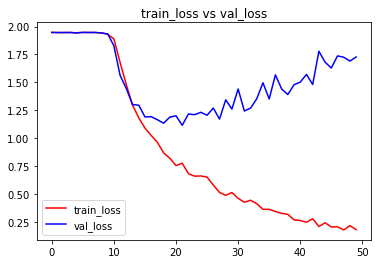
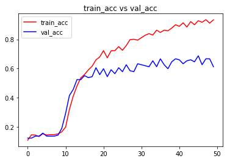

```python
import numpy as np # linear algebra
import pandas as pd # data processing, CSV file I/O (e.g. pd.read_csv)
import os,cv2
import numpy as np
import matplotlib.pyplot as plt
import matplotlib.image as mpimg
from pylab import rcParams
rcParams['figure.figsize'] = 20, 10

from sklearn.utils import shuffle
from sklearn.model_selection import train_test_split

import keras

from keras.utils import np_utils
# Input data files are available in the "../input/" directory.
# For example, running this (by clicking run or pressing Shift+Enter) will list the files in the input directory
from keras.models import Sequential
from keras.layers import Dense , Activation , Dropout ,Flatten
from keras.layers.convolutional import Conv2D
from keras.layers.convolutional import MaxPooling2D
from keras.metrics import categorical_accuracy
from keras.models import model_from_json
from keras.callbacks import ModelCheckpoint
from keras.optimizers import *
from keras.layers.normalization import BatchNormalization
import os
print(os.listdir("./input/KDEF"))
```

    ['AN', 'DI', 'FE', 'HA', 'NE', 'SA', 'SU']
    


```python
data_path = './input/KDEF'
data_dir_list = os.listdir(data_path)

img_rows=256
img_cols=256
num_channel=1

num_epoch=10

img_data_list=[]


for dataset in data_dir_list:
    img_list=os.listdir(data_path+'/'+ dataset)
    print ('Loaded the images of dataset-'+'{}\n'.format(dataset))
    for img in img_list:
        input_img=cv2.imread(data_path + '/'+ dataset + '/'+ img )
        #input_img=cv2.cvtColor(input_img, cv2.COLOR_BGR2GRAY)
        input_img_resize=cv2.resize(input_img,(48,48))
        img_data_list.append(input_img_resize)
        
img_data = np.array(img_data_list)
img_data = img_data.astype('float32')
img_data = img_data/255
img_data.shape
```

    Loaded the images of dataset-AN
    
    Loaded the images of dataset-DI
    
    Loaded the images of dataset-FE
    
    Loaded the images of dataset-HA
    
    Loaded the images of dataset-NE
    
    Loaded the images of dataset-SA
    
    Loaded the images of dataset-SU
    
    


    (980, 48, 48, 3)


```python
num_classes = 7

num_of_samples = img_data.shape[0]
labels = np.ones((num_of_samples,),dtype='int64')

labels[0:139]=0 #140
labels[140:279]=1 #140
labels[280:419]=2 #140
labels[420:559]=3 #140
labels[560:699]=4 #140
labels[700:839]=5 #140
labels[840:979]=6 #140

names = ['anger','disgust','fear','happy','neutral','sadness','surprise']

def getLabel(id):
    return ['anger','disgust','fear','happy','neutral','sadness','surprise'][id]
```


```python
Y = np_utils.to_categorical(labels, num_classes)

#Shuffle the dataset
x,y = shuffle(img_data,Y, random_state=2)
# Split the dataset
X_train, X_test, y_train, y_test = train_test_split(x, y, test_size=0.15, random_state=2)
x_test=X_test
```


```python
input_shape=(48,48,3)

model = Sequential()
model.add(Conv2D(6, (5, 5), input_shape=input_shape, padding='same', activation = 'relu'))
model.add(MaxPooling2D(pool_size=(2, 2)))

model.add(Conv2D(16, (5, 5), padding='same', activation = 'relu'))
model.add(Activation('relu'))
model.add(MaxPooling2D(pool_size=(2, 2)))

model.add(Conv2D(64, (3, 3), activation = 'relu'))
model.add(MaxPooling2D(pool_size=(2, 2)))

model.add(Flatten())
model.add(Dense(128, activation = 'relu'))
model.add(Dropout(0.5))
model.add(Dense(7, activation = 'softmax'))

model.compile(loss='categorical_crossentropy', metrics=['accuracy'],optimizer='adam')
```


```python
model.summary()
model.get_config()
model.layers[0].get_config()
model.layers[0].input_shape
model.layers[0].output_shape
model.layers[0].get_weights()
np.shape(model.layers[0].get_weights()[0])
model.layers[0].trainable
```

    Model: "sequential"
    _________________________________________________________________
    Layer (type)                 Output Shape              Param #   
    =================================================================
    conv2d (Conv2D)              (None, 48, 48, 6)         456       
    _________________________________________________________________
    max_pooling2d (MaxPooling2D) (None, 24, 24, 6)         0         
    _________________________________________________________________
    conv2d_1 (Conv2D)            (None, 24, 24, 16)        2416      
    _________________________________________________________________
    activation (Activation)      (None, 24, 24, 16)        0         
    _________________________________________________________________
    max_pooling2d_1 (MaxPooling2 (None, 12, 12, 16)        0         
    _________________________________________________________________
    conv2d_2 (Conv2D)            (None, 10, 10, 64)        9280      
    _________________________________________________________________
    max_pooling2d_2 (MaxPooling2 (None, 5, 5, 64)          0         
    _________________________________________________________________
    flatten (Flatten)            (None, 1600)              0         
    _________________________________________________________________
    dense (Dense)                (None, 128)               204928    
    _________________________________________________________________
    dropout (Dropout)            (None, 128)               0         
    _________________________________________________________________
    dense_1 (Dense)              (None, 7)                 903       
    =================================================================
    Total params: 217,983
    Trainable params: 217,983
    Non-trainable params: 0
    _________________________________________________________________
    


    True


```python
from keras import callbacks
filename='model_train_new.csv'
filepath="Best-weights-my_model-{epoch:03d}-{loss:.4f}-{acc:.4f}.hdf5"

csv_log=callbacks.CSVLogger(filename, separator=',', append=False)
checkpoint = callbacks.ModelCheckpoint(filepath, monitor='val_loss', verbose=1, save_best_only=True, mode='min')
callbacks_list = [csv_log,checkpoint]
callbacks_list = [csv_log]
```


```python
hist = model.fit(X_train, y_train, batch_size=7, epochs=50, verbose=1, validation_data=(X_test, y_test),callbacks=callbacks_list)
```

    Epoch 1/50
    119/119 [==============================] - 2s 18ms/step - loss: 1.9494 - accuracy: 0.1080 - val_loss: 1.9464 - val_accuracy: 0.1224
    Epoch 2/50
    119/119 [==============================] - 2s 13ms/step - loss: 1.9463 - accuracy: 0.1453 - val_loss: 1.9468 - val_accuracy: 0.1224
    Epoch 3/50
    119/119 [==============================] - 2s 14ms/step - loss: 1.9459 - accuracy: 0.1429 - val_loss: 1.9474 - val_accuracy: 0.1361
    Epoch 4/50
    119/119 [==============================] - 2s 17ms/step - loss: 1.9467 - accuracy: 0.1333 - val_loss: 1.9475 - val_accuracy: 0.1361
    Epoch 5/50
    119/119 [==============================] - 2s 17ms/step - loss: 1.9450 - accuracy: 0.1525 - val_loss: 1.9428 - val_accuracy: 0.1565
    Epoch 6/50
    119/119 [==============================] - 1s 12ms/step - loss: 1.9483 - accuracy: 0.1441 - val_loss: 1.9477 - val_accuracy: 0.1361
    Epoch 7/50
    119/119 [==============================] - 2s 14ms/step - loss: 1.9467 - accuracy: 0.1465 - val_loss: 1.9475 - val_accuracy: 0.1361
    Epoch 8/50
    119/119 [==============================] - 3s 21ms/step - loss: 1.9466 - accuracy: 0.1465 - val_loss: 1.9479 - val_accuracy: 0.1361
    Epoch 9/50
    119/119 [==============================] - 1s 11ms/step - loss: 1.9436 - accuracy: 0.1513 - val_loss: 1.9425 - val_accuracy: 0.1429
    Epoch 10/50
    119/119 [==============================] - 1s 12ms/step - loss: 1.9312 - accuracy: 0.1657 - val_loss: 1.9345 - val_accuracy: 0.1905
    Epoch 11/50
    119/119 [==============================] - 2s 14ms/step - loss: 1.8896 - accuracy: 0.1981 - val_loss: 1.8272 - val_accuracy: 0.2925
    Epoch 12/50
    119/119 [==============================] - 2s 16ms/step - loss: 1.6773 - accuracy: 0.3193 - val_loss: 1.5618 - val_accuracy: 0.4150
    Epoch 13/50
    119/119 [==============================] - 2s 16ms/step - loss: 1.4787 - accuracy: 0.4094 - val_loss: 1.4445 - val_accuracy: 0.4558
    Epoch 14/50
    119/119 [==============================] - 3s 22ms/step - loss: 1.2954 - accuracy: 0.4802 - val_loss: 1.3008 - val_accuracy: 0.5238
    Epoch 15/50
    119/119 [==============================] - 1s 11ms/step - loss: 1.1823 - accuracy: 0.5354 - val_loss: 1.2953 - val_accuracy: 0.5238
    Epoch 16/50
    119/119 [==============================] - 2s 13ms/step - loss: 1.0899 - accuracy: 0.5594 - val_loss: 1.1900 - val_accuracy: 0.5510
    Epoch 17/50
    119/119 [==============================] - 2s 15ms/step - loss: 1.0242 - accuracy: 0.5906 - val_loss: 1.1924 - val_accuracy: 0.5374
    Epoch 18/50
    119/119 [==============================] - 2s 15ms/step - loss: 0.9626 - accuracy: 0.6158 - val_loss: 1.1651 - val_accuracy: 0.5442
    Epoch 19/50
    119/119 [==============================] - 2s 16ms/step - loss: 0.8675 - accuracy: 0.6591 - val_loss: 1.1336 - val_accuracy: 0.6054
    Epoch 20/50
    119/119 [==============================] - 3s 22ms/step - loss: 0.8196 - accuracy: 0.6795 - val_loss: 1.1883 - val_accuracy: 0.5578
    Epoch 21/50
    119/119 [==============================] - 1s 12ms/step - loss: 0.7537 - accuracy: 0.7227 - val_loss: 1.1999 - val_accuracy: 0.5986
    Epoch 22/50
    119/119 [==============================] - 3s 23ms/step - loss: 0.7749 - accuracy: 0.6735 - val_loss: 1.1151 - val_accuracy: 0.5442
    Epoch 23/50
    119/119 [==============================] - 2s 17ms/step - loss: 0.6813 - accuracy: 0.7215 - val_loss: 1.2166 - val_accuracy: 0.5918
    Epoch 24/50
    119/119 [==============================] - 2s 14ms/step - loss: 0.6588 - accuracy: 0.7227 - val_loss: 1.2103 - val_accuracy: 0.5646
    Epoch 25/50
    119/119 [==============================] - 2s 14ms/step - loss: 0.6608 - accuracy: 0.7503 - val_loss: 1.2314 - val_accuracy: 0.6054
    Epoch 26/50
    119/119 [==============================] - 2s 21ms/step - loss: 0.6501 - accuracy: 0.7251 - val_loss: 1.2052 - val_accuracy: 0.5782
    Epoch 27/50
    119/119 [==============================] - 2s 15ms/step - loss: 0.5787 - accuracy: 0.7575 - val_loss: 1.2697 - val_accuracy: 0.6259
    Epoch 28/50
    119/119 [==============================] - 2s 15ms/step - loss: 0.5128 - accuracy: 0.7983 - val_loss: 1.1705 - val_accuracy: 0.5850
    Epoch 29/50
    119/119 [==============================] - 2s 15ms/step - loss: 0.4872 - accuracy: 0.8007 - val_loss: 1.3429 - val_accuracy: 0.5782
    Epoch 30/50
    119/119 [==============================] - 2s 16ms/step - loss: 0.5123 - accuracy: 0.7947 - val_loss: 1.2609 - val_accuracy: 0.6327
    Epoch 31/50
    119/119 [==============================] - 2s 15ms/step - loss: 0.4597 - accuracy: 0.8115 - val_loss: 1.4403 - val_accuracy: 0.6259
    Epoch 32/50
    119/119 [==============================] - 2s 16ms/step - loss: 0.4250 - accuracy: 0.8283 - val_loss: 1.2432 - val_accuracy: 0.6190
    Epoch 33/50
    119/119 [==============================] - 2s 16ms/step - loss: 0.4430 - accuracy: 0.8391 - val_loss: 1.2692 - val_accuracy: 0.6122
    Epoch 34/50
    119/119 [==============================] - 2s 15ms/step - loss: 0.4113 - accuracy: 0.8295 - val_loss: 1.3532 - val_accuracy: 0.6531
    Epoch 35/50
    119/119 [==============================] - 2s 14ms/step - loss: 0.3616 - accuracy: 0.8631 - val_loss: 1.4960 - val_accuracy: 0.6122
    Epoch 36/50
    119/119 [==============================] - 2s 15ms/step - loss: 0.3614 - accuracy: 0.8475 - val_loss: 1.3511 - val_accuracy: 0.6667
    Epoch 37/50
    119/119 [==============================] - 3s 23ms/step - loss: 0.3421 - accuracy: 0.8631 - val_loss: 1.5671 - val_accuracy: 0.6259
    Epoch 38/50
    119/119 [==============================] - 2s 13ms/step - loss: 0.3252 - accuracy: 0.8583 - val_loss: 1.4411 - val_accuracy: 0.5986
    Epoch 39/50
    119/119 [==============================] - 2s 18ms/step - loss: 0.3164 - accuracy: 0.8776 - val_loss: 1.3909 - val_accuracy: 0.6463
    Epoch 40/50
    119/119 [==============================] - 2s 17ms/step - loss: 0.2669 - accuracy: 0.9004 - val_loss: 1.4792 - val_accuracy: 0.6667
    Epoch 41/50
    119/119 [==============================] - 1s 12ms/step - loss: 0.2612 - accuracy: 0.8896 - val_loss: 1.5022 - val_accuracy: 0.6599
    Epoch 42/50
    119/119 [==============================] - 2s 14ms/step - loss: 0.2458 - accuracy: 0.9136 - val_loss: 1.5710 - val_accuracy: 0.6327
    Epoch 43/50
    119/119 [==============================] - 2s 15ms/step - loss: 0.2771 - accuracy: 0.8848 - val_loss: 1.4808 - val_accuracy: 0.6531
    Epoch 44/50
    119/119 [==============================] - 2s 13ms/step - loss: 0.2069 - accuracy: 0.9220 - val_loss: 1.7791 - val_accuracy: 0.6599
    Epoch 45/50
    119/119 [==============================] - 2s 13ms/step - loss: 0.2409 - accuracy: 0.9004 - val_loss: 1.6806 - val_accuracy: 0.6463
    Epoch 46/50
    119/119 [==============================] - 2s 14ms/step - loss: 0.2032 - accuracy: 0.9280 - val_loss: 1.6289 - val_accuracy: 0.6871
    Epoch 47/50
    119/119 [==============================] - 2s 15ms/step - loss: 0.2055 - accuracy: 0.9172 - val_loss: 1.7372 - val_accuracy: 0.6259
    Epoch 48/50
    119/119 [==============================] - 2s 20ms/step - loss: 0.1769 - accuracy: 0.9352 - val_loss: 1.7253 - val_accuracy: 0.6667
    Epoch 49/50
    119/119 [==============================] - 2s 21ms/step - loss: 0.2153 - accuracy: 0.9112 - val_loss: 1.6910 - val_accuracy: 0.6667
    Epoch 50/50
    119/119 [==============================] - 1s 12ms/step - loss: 0.1788 - accuracy: 0.9340 - val_loss: 1.7276 - val_accuracy: 0.6122
    
score = model.evaluate(X_test, y_test, verbose=0)
print('Test Loss:', score[0])
print('Test accuracy:', score[1])

test_image = X_test[0:1]
print (test_image.shape)

print(model.predict(test_image))
print(model.predict_classes(test_image))
print(y_test[0:1])

res = model.predict_classes(X_test[9:18])
plt.figure(figsize=(10, 10))

for i in range(0, 9):
    plt.subplot(330 + 1 + i)
    plt.imshow(x_test[i],cmap=plt.get_cmap('gray'))
    plt.gca().get_xaxis().set_ticks([])
    plt.gca().get_yaxis().set_ticks([])
    plt.ylabel('prediction = %s' % getLabel(res[i]), fontsize=14)
# show the plot
plt.show()

```python
# visualizing losses and accuracy
%matplotlib inline

train_loss=hist.history['loss']
val_loss=hist.history['val_loss']
train_acc=hist.history['accuracy']
val_acc=hist.history['val_accuracy']

epochs = range(len(train_acc))

plt.plot(epochs,train_loss,'r', label='train_loss')
plt.plot(epochs,val_loss,'b', label='val_loss')
plt.title('train_loss vs val_loss')
plt.legend()
plt.figure()

plt.plot(epochs,train_acc,'r', label='train_acc')
plt.plot(epochs,val_acc,'b', label='val_acc')
plt.title('train_acc vs val_acc')
plt.legend()
plt.figure()
```


    <Figure size 432x288 with 0 Axes>


    

    


    

    


    <Figure size 432x288 with 0 Axes>


```python

```
