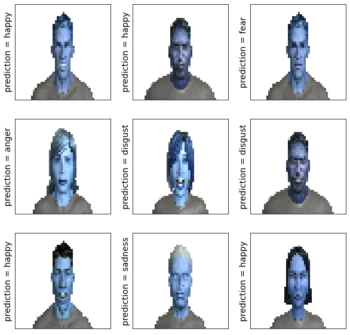
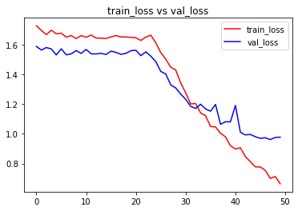
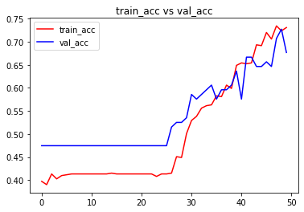

```python
import numpy as np # linear algebra
import pandas as pd # data processing, CSV file I/O (e.g. pd.read_csv)
import os,cv2
import numpy as np
import matplotlib.pyplot as plt
import matplotlib.image as mpimg
from pylab import rcParams
rcParams['figure.figsize'] = 20, 10

from sklearn.utils import shuffle
from sklearn.model_selection import train_test_split

import keras

from keras.utils import np_utils
# Input data files are available in the "../input/" directory.
# For example, running this (by clicking run or pressing Shift+Enter) will list the files in the input directory
from keras.models import Sequential
from keras.layers import Dense , Activation , Dropout ,Flatten
from keras.layers.convolutional import Conv2D
from keras.layers.convolutional import MaxPooling2D
from keras.metrics import categorical_accuracy
from keras.models import model_from_json
from keras.callbacks import ModelCheckpoint
from keras.optimizers import *
from keras.layers.normalization import BatchNormalization
import os
print(os.listdir("./input/UIBFED"))
```

    ['ANGER', 'DISGUST', 'FEAR', 'JOY', 'NEUTRAL', 'SADNESS', 'SURPRISE']
    


```python
data_path = './input/UIBFED'
data_dir_list = os.listdir(data_path)

img_rows=256
img_cols=256
num_channel=1

num_epoch=10

img_data_list=[]


for dataset in data_dir_list:
    img_list=os.listdir(data_path+'/'+ dataset)
    print ('Loaded the images of dataset-'+'{}\n'.format(dataset))
    for img in img_list:
        input_img=cv2.imread(data_path + '/'+ dataset + '/'+ img )
        #input_img=cv2.cvtColor(input_img, cv2.COLOR_BGR2GRAY)
        input_img_resize=cv2.resize(input_img,(48,48))
        img_data_list.append(input_img_resize)
        
img_data = np.array(img_data_list)
img_data = img_data.astype('float32')
img_data = img_data/255
img_data.shape
```

    Loaded the images of dataset-ANGER
    
    Loaded the images of dataset-DISGUST
    
    Loaded the images of dataset-FEAR
    
    Loaded the images of dataset-JOY
    
    Loaded the images of dataset-NEUTRAL
    
    Loaded the images of dataset-SADNESS
    
    Loaded the images of dataset-SURPRISE
    
    


    (660, 48, 48, 3)


```python
num_classes = 7

num_of_samples = img_data.shape[0]
labels = np.ones((num_of_samples,),dtype='int64')

labels[0:79]=0 #230
labels[80:139]=1 #230
labels[140:219]=2 #230
labels[220:499]=3 #230
labels[500:519]=4 #230
labels[520:639]=5 #230
labels[640:659]=6 #230

names = ['anger','disgust','fear','happy','neutral','sadness','surprise']

def getLabel(id):
    return ['anger','disgust','fear','happy','neutral','sadness','surprise'][id]
```


```python
Y = np_utils.to_categorical(labels, num_classes)

#Shuffle the dataset
x,y = shuffle(img_data,Y, random_state=2)
# Split the dataset
X_train, X_test, y_train, y_test = train_test_split(x, y, test_size=0.15, random_state=2)
x_test=X_test
```


```python
input_shape=(48,48,3)

model = Sequential()
model.add(Conv2D(6, (5, 5), input_shape=input_shape, padding='same', activation = 'relu'))
model.add(MaxPooling2D(pool_size=(2, 2)))

model.add(Conv2D(16, (5, 5), padding='same', activation = 'relu'))
model.add(Activation('relu'))
model.add(MaxPooling2D(pool_size=(2, 2)))

model.add(Conv2D(64, (3, 3), activation = 'relu'))
model.add(MaxPooling2D(pool_size=(2, 2)))

model.add(Flatten())
model.add(Dense(128, activation = 'relu'))
model.add(Dropout(0.5))
model.add(Dense(7, activation = 'softmax'))

model.compile(loss='categorical_crossentropy', metrics=['accuracy'],optimizer='adam')
```


```python
model.summary()
model.get_config()
model.layers[0].get_config()
model.layers[0].input_shape
model.layers[0].output_shape
model.layers[0].get_weights()
np.shape(model.layers[0].get_weights()[0])
model.layers[0].trainable
```

    Model: "sequential"
    _________________________________________________________________
    Layer (type)                 Output Shape              Param #   
    =================================================================
    conv2d (Conv2D)              (None, 48, 48, 6)         456       
    _________________________________________________________________
    max_pooling2d (MaxPooling2D) (None, 24, 24, 6)         0         
    _________________________________________________________________
    conv2d_1 (Conv2D)            (None, 24, 24, 16)        2416      
    _________________________________________________________________
    activation (Activation)      (None, 24, 24, 16)        0         
    _________________________________________________________________
    max_pooling2d_1 (MaxPooling2 (None, 12, 12, 16)        0         
    _________________________________________________________________
    conv2d_2 (Conv2D)            (None, 10, 10, 64)        9280      
    _________________________________________________________________
    max_pooling2d_2 (MaxPooling2 (None, 5, 5, 64)          0         
    _________________________________________________________________
    flatten (Flatten)            (None, 1600)              0         
    _________________________________________________________________
    dense (Dense)                (None, 128)               204928    
    _________________________________________________________________
    dropout (Dropout)            (None, 128)               0         
    _________________________________________________________________
    dense_1 (Dense)              (None, 7)                 903       
    =================================================================
    Total params: 217,983
    Trainable params: 217,983
    Non-trainable params: 0
    _________________________________________________________________
    


    True


```python
from keras import callbacks
filename='UIBFED_model.csv'
filepath="Best-weights-my_model-{epoch:03d}-{loss:.4f}-{acc:.4f}.hdf5"

csv_log=callbacks.CSVLogger(filename, separator=',', append=False)
checkpoint = callbacks.ModelCheckpoint(filepath, monitor='val_loss', verbose=1, save_best_only=True, mode='min')
callbacks_list = [csv_log,checkpoint]
callbacks_list = [csv_log]
```


```python
hist = model.fit(X_train, y_train, batch_size=7, epochs=50, verbose=1, validation_data=(X_test, y_test),callbacks=callbacks_list)
```

    Epoch 1/50
    81/81 [==============================] - 1s 13ms/step - loss: 1.7279 - accuracy: 0.3975 - val_loss: 1.5887 - val_accuracy: 0.4747
    Epoch 2/50
    81/81 [==============================] - 1s 9ms/step - loss: 1.6966 - accuracy: 0.3904 - val_loss: 1.5643 - val_accuracy: 0.4747
    Epoch 3/50
    81/81 [==============================] - 1s 10ms/step - loss: 1.6685 - accuracy: 0.4135 - val_loss: 1.5813 - val_accuracy: 0.4747
    Epoch 4/50
    81/81 [==============================] - 1s 9ms/step - loss: 1.6982 - accuracy: 0.4029 - val_loss: 1.5719 - val_accuracy: 0.4747
    Epoch 5/50
    81/81 [==============================] - 1s 10ms/step - loss: 1.6737 - accuracy: 0.4100 - val_loss: 1.5313 - val_accuracy: 0.4747
    Epoch 6/50
    81/81 [==============================] - 1s 10ms/step - loss: 1.6785 - accuracy: 0.4118 - val_loss: 1.5727 - val_accuracy: 0.4747
    Epoch 7/50
    81/81 [==============================] - 1s 10ms/step - loss: 1.6512 - accuracy: 0.4135 - val_loss: 1.5322 - val_accuracy: 0.4747
    Epoch 8/50
    81/81 [==============================] - 1s 9ms/step - loss: 1.6622 - accuracy: 0.4135 - val_loss: 1.5389 - val_accuracy: 0.4747
    Epoch 9/50
    81/81 [==============================] - 1s 10ms/step - loss: 1.6416 - accuracy: 0.4135 - val_loss: 1.5608 - val_accuracy: 0.4747
    Epoch 10/50
    81/81 [==============================] - 1s 10ms/step - loss: 1.6618 - accuracy: 0.4135 - val_loss: 1.5419 - val_accuracy: 0.4747
    Epoch 11/50
    81/81 [==============================] - 1s 10ms/step - loss: 1.6505 - accuracy: 0.4135 - val_loss: 1.5684 - val_accuracy: 0.4747
    Epoch 12/50
    81/81 [==============================] - 1s 10ms/step - loss: 1.6651 - accuracy: 0.4135 - val_loss: 1.5390 - val_accuracy: 0.4747
    Epoch 13/50
    81/81 [==============================] - 1s 10ms/step - loss: 1.6453 - accuracy: 0.4135 - val_loss: 1.5381 - val_accuracy: 0.4747
    Epoch 14/50
    81/81 [==============================] - 1s 10ms/step - loss: 1.6444 - accuracy: 0.4135 - val_loss: 1.5428 - val_accuracy: 0.4747
    Epoch 15/50
    81/81 [==============================] - 1s 9ms/step - loss: 1.6425 - accuracy: 0.4153 - val_loss: 1.5346 - val_accuracy: 0.4747
    Epoch 16/50
    81/81 [==============================] - 1s 10ms/step - loss: 1.6535 - accuracy: 0.4135 - val_loss: 1.5572 - val_accuracy: 0.4747
    Epoch 17/50
    81/81 [==============================] - 1s 9ms/step - loss: 1.6617 - accuracy: 0.4135 - val_loss: 1.5487 - val_accuracy: 0.4747
    Epoch 18/50
    81/81 [==============================] - 1s 10ms/step - loss: 1.6525 - accuracy: 0.4135 - val_loss: 1.5355 - val_accuracy: 0.4747
    Epoch 19/50
    81/81 [==============================] - 1s 9ms/step - loss: 1.6526 - accuracy: 0.4135 - val_loss: 1.5427 - val_accuracy: 0.4747
    Epoch 20/50
    81/81 [==============================] - 1s 9ms/step - loss: 1.6497 - accuracy: 0.4135 - val_loss: 1.5599 - val_accuracy: 0.4747
    Epoch 21/50
    81/81 [==============================] - 1s 9ms/step - loss: 1.6469 - accuracy: 0.4135 - val_loss: 1.5631 - val_accuracy: 0.4747
    Epoch 22/50
    81/81 [==============================] - 1s 9ms/step - loss: 1.6291 - accuracy: 0.4135 - val_loss: 1.5266 - val_accuracy: 0.4747
    Epoch 23/50
    81/81 [==============================] - 1s 10ms/step - loss: 1.6522 - accuracy: 0.4135 - val_loss: 1.5524 - val_accuracy: 0.4747
    Epoch 24/50
    81/81 [==============================] - 1s 9ms/step - loss: 1.6644 - accuracy: 0.4082 - val_loss: 1.5231 - val_accuracy: 0.4747
    Epoch 25/50
    81/81 [==============================] - 1s 9ms/step - loss: 1.6128 - accuracy: 0.4135 - val_loss: 1.4865 - val_accuracy: 0.4747
    Epoch 26/50
    81/81 [==============================] - 1s 9ms/step - loss: 1.5471 - accuracy: 0.4135 - val_loss: 1.4205 - val_accuracy: 0.4747
    Epoch 27/50
    81/81 [==============================] - 1s 9ms/step - loss: 1.5032 - accuracy: 0.4153 - val_loss: 1.4032 - val_accuracy: 0.5152
    Epoch 28/50
    81/81 [==============================] - 1s 10ms/step - loss: 1.4489 - accuracy: 0.4510 - val_loss: 1.3298 - val_accuracy: 0.5253
    Epoch 29/50
    81/81 [==============================] - 1s 9ms/step - loss: 1.4307 - accuracy: 0.4492 - val_loss: 1.3094 - val_accuracy: 0.5253
    Epoch 30/50
    81/81 [==============================] - 1s 10ms/step - loss: 1.3432 - accuracy: 0.5009 - val_loss: 1.2678 - val_accuracy: 0.5354
    Epoch 31/50
    81/81 [==============================] - 1s 9ms/step - loss: 1.2766 - accuracy: 0.5294 - val_loss: 1.2331 - val_accuracy: 0.5859
    Epoch 32/50
    81/81 [==============================] - 1s 9ms/step - loss: 1.2014 - accuracy: 0.5383 - val_loss: 1.1852 - val_accuracy: 0.5758
    Epoch 33/50
    81/81 [==============================] - 1s 9ms/step - loss: 1.2046 - accuracy: 0.5561 - val_loss: 1.1711 - val_accuracy: 0.5859
    Epoch 34/50
    81/81 [==============================] - 1s 9ms/step - loss: 1.1408 - accuracy: 0.5615 - val_loss: 1.1996 - val_accuracy: 0.5960
    Epoch 35/50
    81/81 [==============================] - 1s 9ms/step - loss: 1.1225 - accuracy: 0.5633 - val_loss: 1.1677 - val_accuracy: 0.6061
    Epoch 36/50
    81/81 [==============================] - 1s 9ms/step - loss: 1.0496 - accuracy: 0.5829 - val_loss: 1.1526 - val_accuracy: 0.5758
    Epoch 37/50
    81/81 [==============================] - 1s 9ms/step - loss: 1.0469 - accuracy: 0.5811 - val_loss: 1.1980 - val_accuracy: 0.5960
    Epoch 38/50
    81/81 [==============================] - 1s 9ms/step - loss: 1.0041 - accuracy: 0.6061 - val_loss: 1.0650 - val_accuracy: 0.5960
    Epoch 39/50
    81/81 [==============================] - 1s 10ms/step - loss: 0.9804 - accuracy: 0.5989 - val_loss: 1.0815 - val_accuracy: 0.6061
    Epoch 40/50
    81/81 [==============================] - 1s 9ms/step - loss: 0.9204 - accuracy: 0.6488 - val_loss: 1.0809 - val_accuracy: 0.6364
    Epoch 41/50
    81/81 [==============================] - 1s 10ms/step - loss: 0.8981 - accuracy: 0.6542 - val_loss: 1.1919 - val_accuracy: 0.5758
    Epoch 42/50
    81/81 [==============================] - 1s 10ms/step - loss: 0.9064 - accuracy: 0.6524 - val_loss: 1.0106 - val_accuracy: 0.6667
    Epoch 43/50
    81/81 [==============================] - 1s 10ms/step - loss: 0.8466 - accuracy: 0.6542 - val_loss: 0.9932 - val_accuracy: 0.6667
    Epoch 44/50
    81/81 [==============================] - 1s 10ms/step - loss: 0.8127 - accuracy: 0.6934 - val_loss: 0.9962 - val_accuracy: 0.6465
    Epoch 45/50
    81/81 [==============================] - 1s 9ms/step - loss: 0.7777 - accuracy: 0.6916 - val_loss: 0.9808 - val_accuracy: 0.6465
    Epoch 46/50
    81/81 [==============================] - 1s 11ms/step - loss: 0.7770 - accuracy: 0.7201 - val_loss: 0.9698 - val_accuracy: 0.6566
    Epoch 47/50
    81/81 [==============================] - 1s 10ms/step - loss: 0.7545 - accuracy: 0.7059 - val_loss: 0.9739 - val_accuracy: 0.6465
    Epoch 48/50
    81/81 [==============================] - 1s 9ms/step - loss: 0.7002 - accuracy: 0.7344 - val_loss: 0.9615 - val_accuracy: 0.7071
    Epoch 49/50
    81/81 [==============================] - 1s 9ms/step - loss: 0.7131 - accuracy: 0.7237 - val_loss: 0.9757 - val_accuracy: 0.7273
    Epoch 50/50
    81/81 [==============================] - 1s 10ms/step - loss: 0.6641 - accuracy: 0.7308 - val_loss: 0.9780 - val_accuracy: 0.6768
    


```python
keras.utils.plot_model(model, to_file='model.png', show_shapes=True)
```

    ('Failed to import pydot. You must `pip install pydot` and install graphviz (https://graphviz.gitlab.io/download/), ', 'for `pydotprint` to work.')
    


```python
score = model.evaluate(X_test, y_test, verbose=0)
print('Test Loss:', score[0])
print('Test accuracy:', score[1])

test_image = X_test[0:1]
print (test_image.shape)

print(model.predict(test_image))
print(model.predict_classes(test_image))
print(y_test[0:1])

res = model.predict_classes(X_test[9:18])
plt.figure(figsize=(10, 10))

for i in range(0, 9):
    plt.subplot(330 + 1 + i)
    plt.imshow(x_test[i],cmap=plt.get_cmap('gray'))
    plt.gca().get_xaxis().set_ticks([])
    plt.gca().get_yaxis().set_ticks([])
    plt.ylabel('prediction = %s' % getLabel(res[i]), fontsize=14)
# show the plot
plt.show()
```

    Test Loss: 0.9779825806617737
    Test accuracy: 0.6767676472663879
    (1, 48, 48, 3)
    [[1.3883096e-01 4.1027346e-01 1.4987729e-04 4.3271208e-01 1.5446247e-03
      1.6475447e-02 1.3658180e-05]]
    WARNING:tensorflow:From C:\Users\Sivajee\AppData\Local\Temp/ipykernel_2544/2922075397.py:9: Sequential.predict_classes (from tensorflow.python.keras.engine.sequential) is deprecated and will be removed after 2021-01-01.
    Instructions for updating:
    Please use instead:* `np.argmax(model.predict(x), axis=-1)`,   if your model does multi-class classification   (e.g. if it uses a `softmax` last-layer activation).* `(model.predict(x) > 0.5).astype("int32")`,   if your model does binary classification   (e.g. if it uses a `sigmoid` last-layer activation).
    [3]
    [[0. 0. 0. 1. 0. 0. 0.]]
    


    

    


```python
# visualizing losses and accuracy
%matplotlib inline

train_loss=hist.history['loss']
val_loss=hist.history['val_loss']
train_acc=hist.history['accuracy']
val_acc=hist.history['val_accuracy']

epochs = range(len(train_acc))

plt.plot(epochs,train_loss,'r', label='train_loss')
plt.plot(epochs,val_loss,'b', label='val_loss')
plt.title('train_loss vs val_loss')
plt.legend()
plt.figure()

plt.plot(epochs,train_acc,'r', label='train_acc')
plt.plot(epochs,val_acc,'b', label='val_acc')
plt.title('train_acc vs val_acc')
plt.legend()
plt.figure()
```


    <Figure size 432x288 with 0 Axes>


    

    


    

    


    <Figure size 432x288 with 0 Axes>


```python

```
